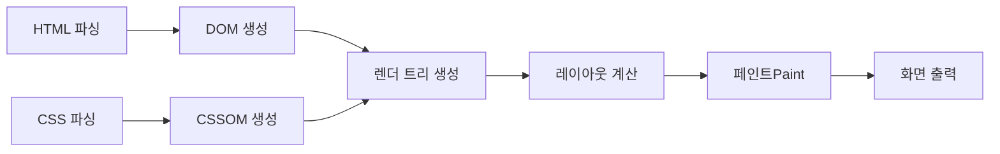
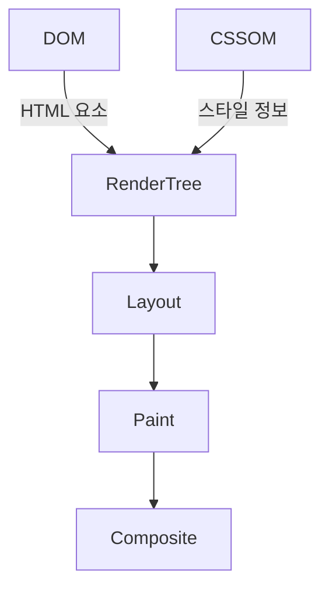

# 브라우저 렌더링 완전 정복: 개발 초보부터 심화까지

웹페이지를 작성할 때 우리는 HTML, CSS, JS를 작성하지만, **브라우저가 실제 화면으로 보여주는 과정**을 이해하면 성능 최적화와 디버깅에 큰 도움이 됩니다.  
이번 글에서는 **렌더링의 단계**, **DOM과 CSSOM**, **렌더 트리**, **레이아웃/페인트**, 그리고 심화 단계까지 체계적으로 정리합니다.

---

## 1. 브라우저 렌더링 기본 흐름 (개발 초보용)

브라우저가 웹페이지를 화면에 그리는 과정은 크게 6단계로 나눌 수 있습니다:

1. **HTML 파싱 → DOM 생성**

   - HTML을 읽고, 브라우저가 **DOM(Document Object Model)** 트리를 만듭니다.

2. **CSS 파싱 → CSSOM 생성**

   - CSS를 읽고, **CSSOM(CSS Object Model)** 트리를 만듭니다.

3. **렌더 트리(Render Tree) 생성**

   - DOM과 CSSOM을 합쳐서 화면에 표시할 요소만 포함한 **렌더 트리**를 만듭니다.

4. **레이아웃(Layout, Reflow)**

   - 각 노드의 크기와 위치를 계산합니다.

5. **페인트(Paint)**

   - 픽셀 단위로 화면에 색, 텍스트, 이미지 등을 그립니다.

6. **합성(Composite)**
   - 여러 레이어를 합쳐 최종 화면을 출력합니다.

### 머메이드 그림으로 표현



## 2. 초보 개발자가 흔히 겪는 문제

1. **DOM 변경 시 느려짐**

- `document.querySelector`를 반복적으로 호출하거나, DOM을 자주 수정하면 Reflow와 Repaint가 발생해 성능 저하

2. **CSS 변경 시 전체 레이아웃 재계산**

- 단일 요소가 아니라, 자식/형제 요소까지 레이아웃 재계산될 수 있음

3. **JS 이벤트 처리와 렌더링 충돌**

- JS에서 DOM을 변경하는 순간 렌더링이 다시 실행 → 프레임 드롭 발생

### 해결 방법 (초보 단계)

- DOM 요소 캐싱

- 이벤트는 **이벤트 위임** 활용

- 변경이 많은 DOM은 **DocumentFragment** 또는 **virtual DOM** 사용

## 3. 심화 단계: 렌더링 최적화

1. **레이아웃과 Repaint/Reflow 이해**

- **Reflow(레이아웃 계산):** 요소 위치, 크기, 스크롤 계산

- **Repaint(페인트):** 색상/배경 등 시각적 변경만

- **성능 팁:** Reflow 발생 최소화

  - display: none으로 DOM 업데이트 후 다시 보여주기

  - class 단위로 스타일 변경

  - requestAnimationFrame 활용

2. **레이어 분리 & GPU 가속**

- CSS에서 transform, opacity를 사용하면 **GPU 레이어** 생성 → Repaint 부담 줄임
  ex)
  ```css
  .box {
    transform: translateZ(0);
    will-change: transform;
  }
  ```

3. **렌더 트리 심화 이해**



## 4. 개발 실무에서 적용

- **DOM 접근 최소화:** 반복문 안에서 DOM 접근 피하기

- **CSS 최적화:** 단일 클래스 변경, 레이아웃 의존적 속성 최소화

- **JS 렌더링 분리:** requestAnimationFrame, virtual DOM, 라이브러리 활용

## 5. Oneul Code를 정리하며...

오늘 **브라우저 렌더링** 과정에 대해 학습하고 직접 예제 코드와 메르메이드 그림을 작성하면서, 브라우저가 HTML, CSS, JS를 어떻게 화면으로 그리는지 단계별로 이해할 수 있었습니다.

- **DOM & CSSOM:** 웹페이지의 구조와 스타일을 브라우저가 객체로 이해

- \*_렌더 트리:_ 실제 화면에 필요한 요소만 선별

- **레이아웃(Layout)과 페인트(Paint):** 요소 위치/크기 계산과 화면 출력

- **Reflow/Repaint 최적화:** 성능 저하를 막기 위한 DOM/CSS 관리 방법

직접 코드를 작성하면서, 단순히 화면에 보이도록 하는 것만이 아니라 성능까지 고려한 설계가 필요하다는 점을 깨달았습니다.

또한, 초보 단계에서는 렌더링의 흐름과 Reflow/Repaint 개념을 이해하고,
심화 단계에서는 GPU 가속, 레이어 분리, requestAnimationFrame 활용 등으로 성능 최적화를 할 수 있음을 확인했습니다.

브라우저 렌더링 구조를 이해하면, 단순한 화면 출력뿐만 아니라 DOM/CSS/JS 설계와 성능 최적화까지 체계적으로 고민할 수 있습니다.
앞으로 웹 개발을 하면서, 렌더링 흐름을 항상 머릿속에 그려두면 코드 수정 시 발생할 영향을 예측하고 효율적인 설계가 가능해집니다.

Oneul Code는 오늘 학습한 내용을 기록하면서, 이 글을 읽는 여러분도 바로 활용할 수 있기를 바랍니다.
